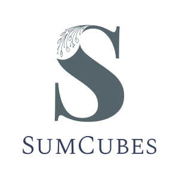

<a name="readme-top"></a>

[![Contributors][contributors-shield]][contributors-url]
[![Forks][forks-shield]][forks-url]
[![Stargazers][stars-shield]][stars-url]
[![Issues][issues-shield]][issues-url]
[![MIT License][license-shield]][license-url]

<!-- PROJECT LOGO -->
<br />
<div align="center">
  <a href="https://github.com/vovansmr/interview">
    
  </a>

<h3 align="center"></h3>

  <p align="center">
    <br />
    <a href="https://github.com/vovansmr/interview"><strong>Explore the docs »</strong></a>
    <br />
    <br />
    <a href="https://github.com/vovansmr/interview">View Demo</a>
    ·
    <a href="https://github.com/vovansmr/interview/issues">Report Bug</a>
    ·
    <a href="https://github.com/vovansmr/interview/issues">Request Feature</a>
  </p>
</div>


<!-- TABLE OF CONTENTS -->
<details>
  <summary>Table of Contents</summary>
  <ol>
    <li>
      <a href="#about-the-project">About The Project</a>
      <ul>
        <li><a href="#1-bruteforse">1. BruteForse:</a></li>
	<li><a href="#2-bruteforcefaster-fast-algorithm">2. BruteForceFaster</a></li>
	<li><a href="#3-thefastest">3. TheFastest</a></li>
      </ul>
    </li>
    <li>
      <a href="#getting-started">Getting Started</a>
      <ul>
        <li><a href="#installation">Installation</a></li>
	<li><a href="#design-patterns">design-patterns</a></li>
      </ul>
    </li>
    <li><a href="#usage">Usage</a></li>
    <li><a href="#license">License</a></li>
    <li><a href="#contact">Contact</a></li>

  </ol>
</details>


<!-- ABOUT THE PROJECT -->
## About The Project
### During a technical interview, a task is encountered
```
a ^ 3 + b ^ 3 = c ^ 3 + d ^ 3 
where 1<=a, b, c, d<=1000.
```
It can be solved in 3 ways:

### 1. BruteForse:
```
min=1;
max=1000;
for (int a=min;a<=max;a++)
  for (int b=min;b<=max;b++)
    for (int c=min;c<=max;c++)
	for (int d=min;d<=max;d++) {
	  if (Math.pow(a, 3)+Math.pow(b, 3)==Math.pow(c, 3)+Math.pow(d, 3)){}
```
Algorithm execution time О(n^4);

### 2. BruteForceFaster (fast algorithm):
```
min=1;
max=1000;
for (int a=min;a<=max;a++)
  for (int b=min;b<=max;b++)
    for (int c=min;c<=max;c++) {
      double tmp = Math.cbrt(Math.pow(a, 3)+Math.pow(b, 3)-Math.pow(c, 3));
	  if (tmp>=min&&tmp<=max&&tmp-((int)tmp)==0) {}
```
Algorithm execution time О(n^3);

### 3. TheFastest:
```
min=1;
max=1000;
HashMap <Integer,HashMap <Integer,TheFastestData>> map;
HashMap <Integer,TheFastestData> tmphash;
for (int a=min;a<=max;a++)
  for (int b=min;b<=max;b++) {
    Integer key = a*a*a+b*b*b;
    if(map.get(key)==null) {
      tmphash=new HashMap<Integer,TheFastestData>();
      map.put(key, tmphash);
    }else 
      tmphash=map.get(key);
     tmphash.put(tmphash.size(), new TheFastestData(a,b));
    }
```
Algorithm execution time О(n^2).


<p align="right">(<a href="#readme-top">back to top</a>)</p>

<!-- GETTING STARTED -->
## Getting Started

## The SumCubes program is written in order to be able to measure the computation time of a problem in practice. When the algorithm is run, the % of completed calculations and the remaining time are calculated.

### Design patterns:
the following patterns were used in the development
- builder
- command
- singleton
- strategy
- adapter
- iterator
- factory
- facade
- lambda expressions were also used.

### Installation

1. Download Project
2. Compile:
```
	javac SumCubes.java
   ```
3. Run:
 ```
	java SumCubes
```
4. Or run with parameters:
```
  java SumCubes --algorithm=BRUTEFORSE [--help] [--min=1] [--max=50] [--writeinfooff] [--writesolutionon]
   ```

<p align="right">(<a href="#readme-top">back to top</a>)</p>


<!-- USAGE EXAMPLES -->
## Usage

The program can be used both with parameters and interactively:

#### Usage examples:  
  ```
  java SumCubes --algorithm=THEFASTEST --min=1 --max=500 --writeinfooff --writesolutionon
launching the THEFASTEST algorithm with the parameters min=1, max=500, switching off the service information and outputting the calculated solutions of the equation.
  java SumCubes --algorithm=THEFASTEST --algorithm=BRUTEFORSEFASTER --min=1 --max=500 --algorithm=BRUTEFORSE --min=100 --max=400
sequential launch of the algorithm: 
  THEFASTEST algorithm with the default parameters min=1, max=1000;
  BRUTEFORSEFASTER algorithm with the parameters min=1, max=500;
  BRUTEFORSE algorithm with the parameters min=100, max=400
```
#### Available options:
```
  --algorithm=name, or -a=name required parameter, you can list several algorithms
that will be executed one after another. Where valid names are bruteforse [or BRUTEFORSE or BF], bruteforsefaster [or BRUTEFORSEFASTER or BFF], thefastest [or THEFASTEST or TF].
  --help or -h  displays this message
  --min=1  optional parameter, specifies the minimum value for the algorithm
  --max=50  optional parameter, specifies the maximum value for the algorithm
  --writeinfooff  disables output of service information
  --writesolutionon  displays the results of solving a cubic equation
additional commands \navailable interactively:
(all commands in interactive mode are entered without prefixes - and --)
  run  runs the specified algorithms
  exit exit interactive mode
```


<p align="right">(<a href="#readme-top">back to top</a>)</p>

<!-- LICENSE -->
## License

Distributed under the MIT License. See `LICENSE.txt` for more information.

<p align="right">(<a href="#readme-top">back to top</a>)</p>

<!-- CONTACT -->
## Contact
my name is Vladimir I am looking for a job as a java developer in Russia
[Telegram](https://t.me/vovansmr)
vovansmr@mail.ru

Project Link: [https://github.com/vovansmr/interview](https://github.com/vovansmr/interview)

<p align="right">(<a href="#readme-top">back to top</a>)</p>

<!-- MARKDOWN LINKS & IMAGES -->
<!-- https://www.markdownguide.org/basic-syntax/#reference-style-links -->
[contributors-shield]: https://img.shields.io/github/contributors/vovansmr/interview.svg?style=for-the-badge
[contributors-url]: https://github.com/vovansmr/interview/graphs/contributors
[forks-shield]: https://img.shields.io/github/forks/vovansmr/interview.svg?style=for-the-badge
[forks-url]: https://github.com/vovansmr/interview/network/members
[stars-shield]: https://img.shields.io/github/stars/vovansmr/interview.svg?style=for-the-badge
[stars-url]: https://github.com/vovansmr/interview/stargazers
[issues-shield]: https://img.shields.io/github/issues/vovansmr/interview.svg?style=for-the-badge
[issues-url]: https://github.com/vovansmr/interview/issues
[license-shield]: https://img.shields.io/github/license/vovansmr/interview.svg?style=for-the-badge
[license-url]: https://github.com/vovansmr/interview/main/LICENSE.txt](https://github.com/vovansmr/interview/blob/main/LICENSE.txt)
